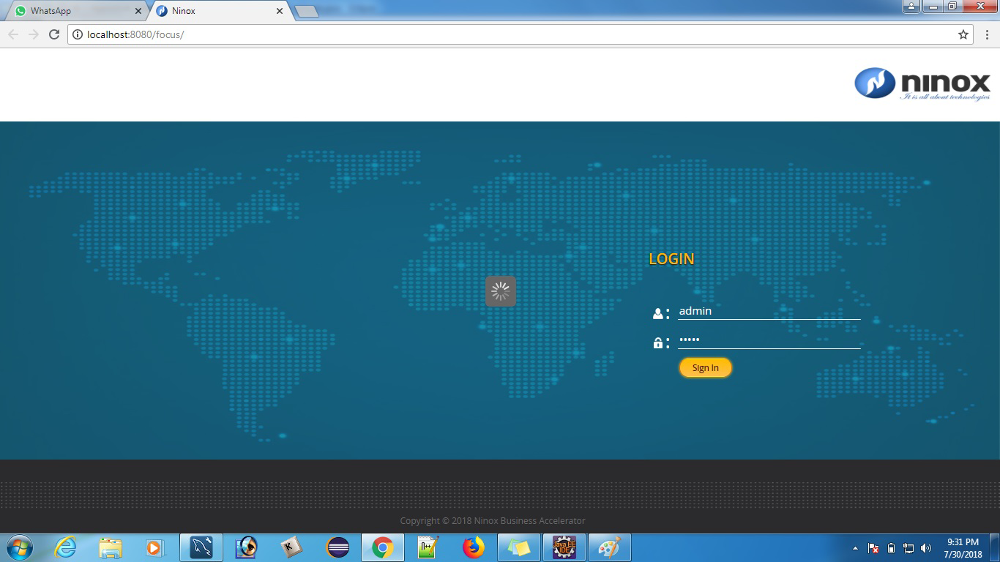
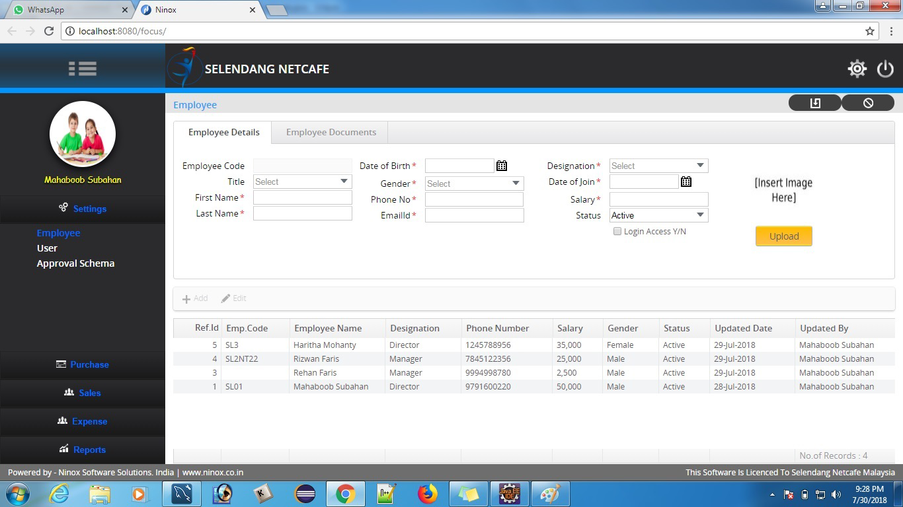

# Vaadin7-Spring-Hibernate-MySql
Vaadin7 Application with Spring, Hibernate, MySql, ehcache, CSS, SCSS &amp; Maven.

### Vaadin-7 Login Page

### Vaadin-7 Main Page

## How to run?
  * Clone this project to your local machine.
    $ git clone https://github.com/subahanih/Vaadin7-Spring-Hibernate-MySql.git
  
  * Go to the folder where keep this project and run below maven commend.
    mvn clean install
      ## (or)
    In your eclise/IDE right click on project Maven Update, Maven Clean & Maven Install
    
  * Configure Appache Tomcat and add this project and start the server

